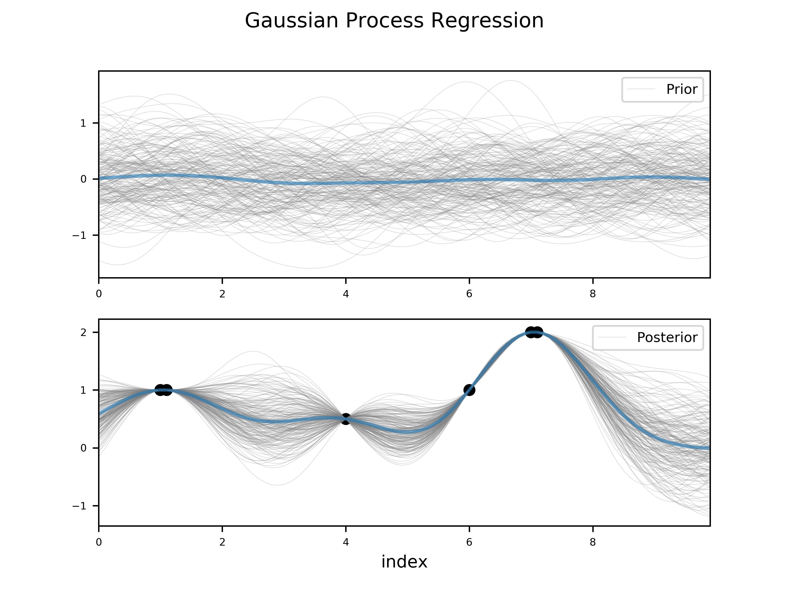

# 高斯过程回归
##  Gaussian Process Regression

***
## 一、高斯分布

高斯过程（Gaussian Process, GP）是随机过程之一，是一系列符合正态分布的随机变量在一指数集（index set）内的集合。

***1.1 一元高斯分布***  

$$
X \sim N(\mu, \sigma^2)
$$

其概率密度函数为：

$$
f(x) = \frac{1}{\sigma \sqrt{2 \pi}}e^{{-(x - \mu)^2} / ({2 \sigma^2})}
$$

标准正态分布：

$$
\mu = 0, \sigma = 1
$$

正态分布具有如下性质：

1. 如果$X \sim N(\mu, \sigma^2)$，且$a$、$b$均为实数，则$aX + b \sim N(a \mu + b, (a \sigma)^2)$；

2. 如果$X \sim N(\mu_x, \sigma_x^2)$与$Y \sim N(\mu_y, \sigma_y^2)$独立，则：

   1. $U = X + Y \sim N(\mu_x + \mu_y, \sigma_x^2 + \sigma_y^2)$；
   2. $V = X - Y \sim N(\mu_x - \mu_y, \sigma_x^2 + \sigma_y^2)$；

3. 若以上$X$与$Y$相互独立，则：

   1. $XY$符合以下概率密度分布：

      $$
      p(z)=\frac{1}{\pi \sigma_x \sigma_y}K_0(\frac{|z|}{\sigma_x \sigma_y})
      $$

      其中$K_0$为修正贝塞尔函数；

   2. $X/Y$符合柯西分布：

      $$
      X/Y \sim {\rm Cauchy}(0, \sigma_x / \sigma_y)
      $$

4. 若$X_1, ..., X_n$各自独立，符合正态分布，则$X_1^2 + X_2^2 + ... + X_n^2$符合自由度为$n$的卡方分布；

***1.2 二元高斯分布***

$$
f(x,y) = A \exp (-(\frac{x - x_0)^2}{2\sigma_x^2} + \frac{(y - y_0)^2}{2\sigma_y^2}))
$$

***1.3 多元高斯分布***

$$
p(x) = \frac{1}{(2\pi)^{n/2} |\Sigma|^{1/2}} \ \exp(-\frac{1}{2} (x - \mu)^T \Sigma^{-1} (x - \mu))
$$

其中，$\mu$为各随机变量的均值组成的$n \times 1$向量，$\Sigma$表示随机变量间的$n \times n$协方差矩阵，正定。

***
## 二、多元高斯分布的条件概率密度

令随机向量$X = [x_1, x_2, ..., x_n]$服从多元高斯分布$X \sim N(\mu, \Sigma)$，令$X_1 = [x_1, ..., x_m]$为已经观测变量，$X_2 = [x_{m+1}, ..., x_n]$为未知变量，则：

$$
\begin{aligned}
X = \left(
	\begin{array}{c}
	X_1 \\
	X_2
	\end{array}
\right)
\end{aligned}
$$

从而有：

$$
\begin{aligned}
\mu = \left(
	\begin{array}{c}
	\mu_1 \\
	\mu_2
	\end{array}
\right)
\end{aligned}
$$

$$
\begin{aligned}
\Sigma = \left[
	\begin{aligned}{}
	\Sigma_{11}, &\Sigma_{12} \\
	\Sigma_{21}, &\Sigma_{22}
	\end{aligned}
\right]
\end{aligned}
$$

给定$X_1$求$X_2$的后验分布（这部分推导可以从相关文献中查到，此处略）：

$$
\mu_{2|1} = \mu_2 + \Sigma_{21} \Sigma_{11}^{-1}(X_1 - \mu_1)
$$

$$
\Sigma_{2|1} = \Sigma_{22} - \Sigma_{21} \Sigma_{11}^{-1} \Sigma_{12}
$$

***
## 三、高斯过程回归

高斯过程是一系列服从正态分布的随机变量在一指数集（index set）内的组合。设随机变量$X = [x_1, x_2, x_3, ..., x_n]^T$，其服从正态分布：
$$
X \sim N(\mu, \Sigma)
$$
其中$\mu$为均值向量，$\Sigma$为协方差矩阵。

***3.1 协方差矩阵计算***
$\Sigma$可以通过高斯过程核进行求解，常见的高斯过程核有：

*RBF kernel:*

$$
k = \sigma^2 \exp(-\frac{||t_a - t_b||^2}{2l^2})
$$

*periodic kernel:*

$$
k = \sigma^2 \exp(-\frac{2}{l^2} \sin(\frac{\pi}{p})|t_a - t_b|)
$$

*linear_kernel:*

$$
k = \sigma_b^2 + \sigma^2 * (t_a - c)(t_b - c)
$$

这样当知道两个随机变量指数$t_a$和$t_b$后，便可通过核函数计算两个变量间的协方差。如果对所有随机变量均进行上述计算便可获得协方差矩阵$\Sigma$。有了协方差矩阵$\Sigma$后便可对高斯过程进行采样（一般认为高斯过程先验分布均值$\mu$应无偏为0）。

***3.2 高斯过程采样***
获得了各随机变量$x$的均值信息$\mu$和联合分布的协方差矩阵$\Sigma$后，便可对该高斯过程进行随机采样。采样步骤如下：

1. 首先对协方差矩阵$\Sigma$进行SVD分解，获得矩阵$\rm U$、$\rm S$和$\rm V$；

2. 生成$N$个独立同分布的高斯随机变量（均值为0，标准差为1），组成向量$y$；

3. 按照如下公式获得高斯过程样本：

   $$
   x = \mu + {\rm U} \sqrt{\rm S}y
   $$

***3.3 后验分布和采样***
3.2中获得的高斯过程样本为先验样本。但是当我们在某些指数$t$上获得了一批观测样本后，这批观测样本将有助于我们对其他指数集上的样本分布进行估计（后验）。我们将这批已观测指数集设为$X_1$，未观测到的指数集设为$X_2$。接下来便可使用第二节中的方法获得在$X_2$上样本分布后验概率参数$\mu_{2|1}$和$\Sigma_{2|1}$，最后重新对$X_2$上的随机变量进行采样。封面图显示了先验分布样本和后验分布样本的对比：
